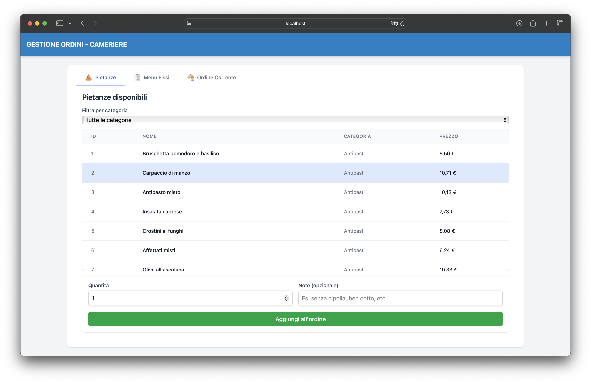
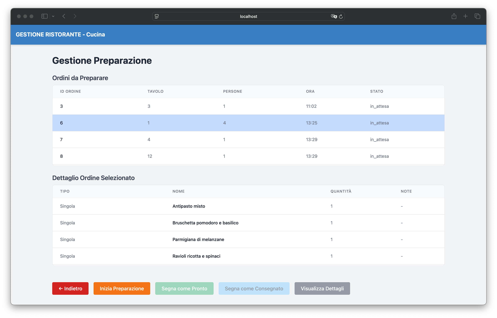
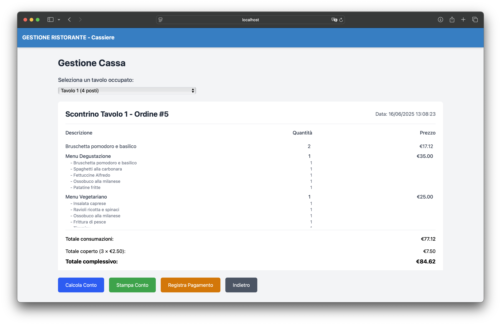
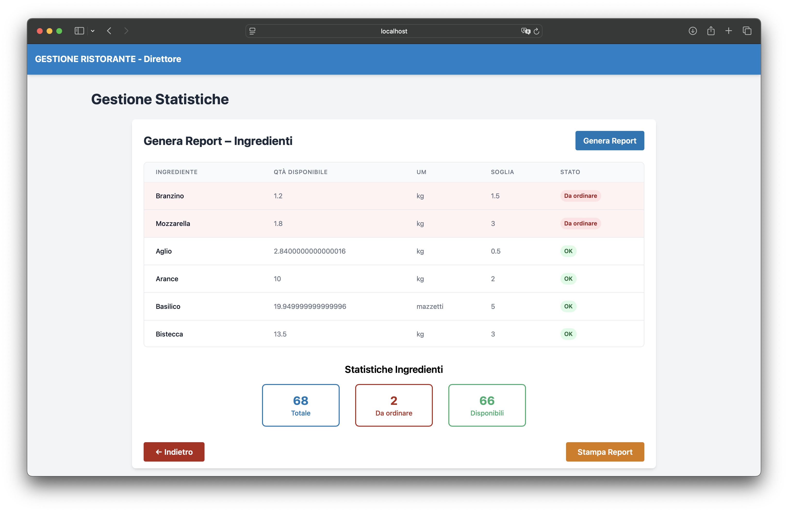
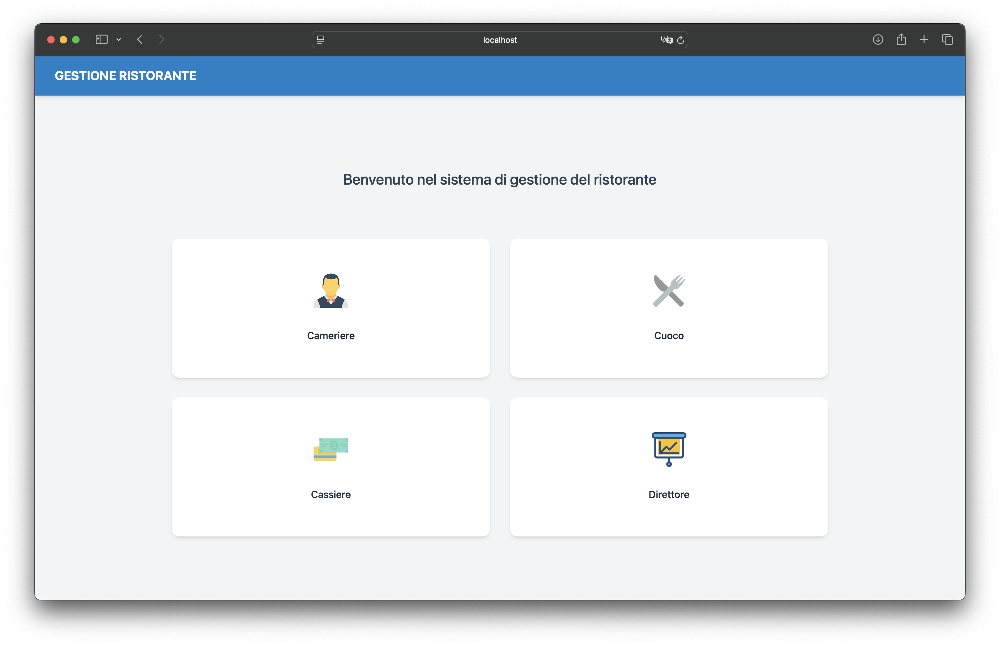
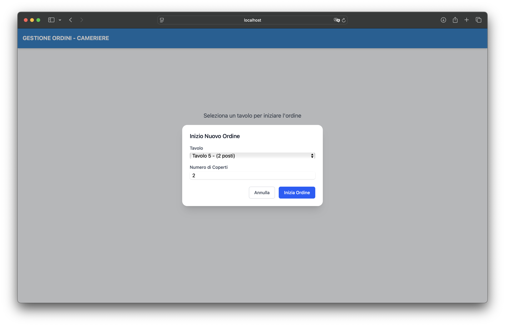
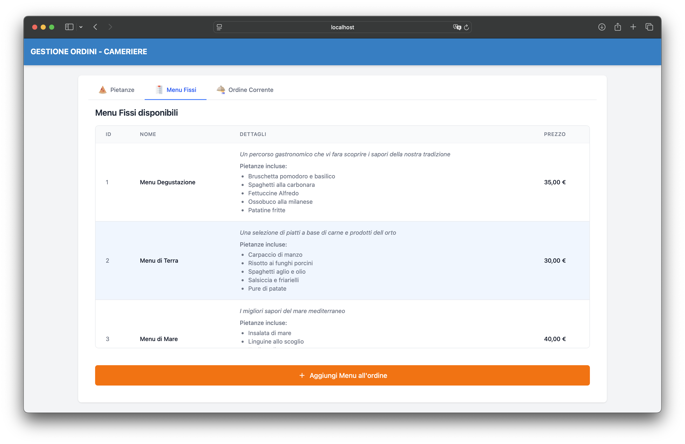
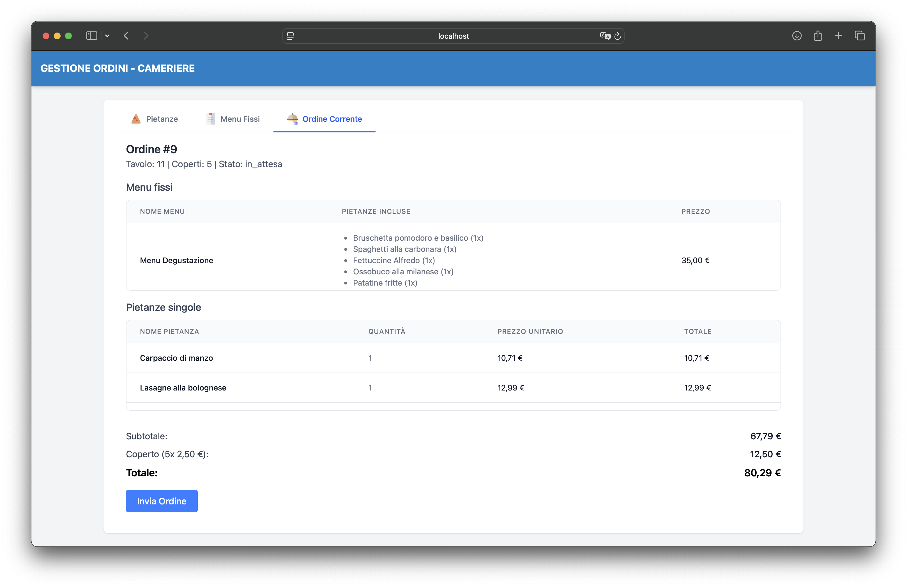
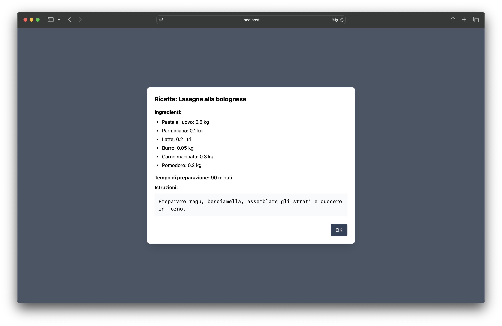

# 🍽️ Ristorante Frontend

Frontend per l'applicazione di gestione ristorante, sviluppato con React, TypeScript e Vite.
Progetto realizzato come parte del corso di **Ingegneria del Software**. Servito dall'api a [Ristorante-api](https://github.com/GGCIRILLO/Ristorante-api).

## 📂 Struttura del progetto

```
Ristorante-Frontend/
├── public/               # File statici accessibili pubblicamente
├── src/                  # Codice sorgente dell'applicazione
│   ├── api/              # Client API per comunicare con il backend
│   ├── assets/           # Risorse statiche (immagini, icone)
│   ├── components/       # Componenti React riutilizzabili
│   ├── hooks/            # Custom hooks React per gestire la logica di stato
│   ├── pages/            # Componenti pagina per ciascuna vista
│   └── types/            # Definizioni di tipi TypeScript
├── index.html            # Entrypoint HTML dell'applicazione
├── tsconfig.json         # Configurazione TypeScript
└── vite.config.ts        # Configurazione Vite
```

## 🛠️ Tecnologie e librerie

- **Vite 6.3.5**: Build tool e dev server ultra-rapido per progetti frontend
- **React 19.1.0**: Libreria JavaScript per la creazione di interfacce utente
- **TypeScript 5.8.3**: Superset di JavaScript con tipizzazione statica
- **Tailwind CSS 4.1.10**: Framework CSS utility-first per design rapido e responsive
- **TanStack Query 5.80.7**: Libreria per gestire lo stato del server, cache e sincronizzazione
- **React Router 7.6.2**: Libreria di routing per navigazione client-side in React
- **Headless UI 2.2.4**: Componenti UI accessibili e non stilizzati per modali e dropdown

### ⚡️ Caching con TanStack Query

TanStack Query implementa una sofisticata strategia di caching lato client che ottimizza le prestazioni dell'applicazione:

1. **Cache intelligente**: Memorizza automaticamente i risultati delle query API, riducendo le chiamate ridondanti al server e velocizzando l'esperienza utente.

2. **Aggiornamenti ottimistici**: Permette di aggiornare l'UI immediatamente dopo un'azione utente, senza attendere la risposta dal server, grazie agli optimistic updates.

3. **Invalidazione selettiva**: Aggiorna automaticamente i dati correlati quando avvengono modifiche, mantenendo la UI sincronizzata.

#### Caching client vs Redis server

Sebbene il backend utilizzi Redis per il caching lato server, abbiamo scelto di implementare anche il caching lato client con TanStack Query per i seguenti vantaggi:

- **Riduzione del traffico di rete**: Anche con Redis, ogni richiesta comporta comunque un round-trip al server. TanStack Query elimina completamente molte di queste chiamate.

- **Esperienza offline-first**: Gli utenti possono continuare a navigare tra dati già caricati anche in caso di connessione instabile.

- **Sincronizzazione automatica**: TanStack Query gestisce automaticamente il riacquisizione dei dati quando tornano in focus o dopo un periodo configurabile.

#### Esempio reale: collaborazione tra i due sistemi di cache

**Scenario**: Un cameriere visualizza la lista delle pietanze disponibili.

**Senza caching**:

1. Ogni volta che il cameriere passa dalla schermata ordini a quella pietanze: nuova richiesta HTTP.
2. Il server esegue query al database ad ogni richiesta.
3. Risultato: lentezza percepita e carico inutile sul backend.

**Con Redis (solo lato server)**:

1. Prima richiesta: il server interroga il DB e memorizza in Redis.
2. Richieste successive: il server recupera da Redis (più veloce del DB).
3. Ma: ogni cambio di schermata comporta comunque una richiesta HTTP.

**Con TanStack Query + Redis**:

1. Prima richiesta: il server recupera da Redis, il client memorizza nella cache TanStack.
2. Cambi di schermata successivi: nessuna richiesta HTTP se i dati sono considerati "freschi".
3. In background: TanStack Query può riconvalidare i dati quando necessario.
4. Modifiche (es. nuova pietanza): TanStack invalida selettivamente solo i dati necessari.

Questo approccio "a due livelli" ottimizza sia l'esperienza utente (UI reattiva) che le prestazioni del server (meno carico sul database).

## 🌟 Funzionalità principali

### 🤵‍♂️ Cameriere

Il cameriere può selezionare i tavoli, visualizzare i menù fissi e le pietanze disponibili, con un tab dedicato al riepilogo dell'ordine corrente.



### 👨‍🍳 Cuoco

Il cuoco visualizza gli ordini da preparare, può consultare le ricette e aggiornare lo stato degli ordini (in preparazione, pronto o consegnato).



### 💰 Cassiere

Il cassiere gestisce i pagamenti, emette scontrini e registra i pagamenti. Può visualizzare lo stato dei tavoli occupati.



### 👔 Direttore

Il direttore può visualizzare report sugli ingredienti esauriti e da riordinare.



## 🚀 Installazione e avvio

### Prerequisiti

- Node.js (v20 o superiore)
- pnpm (v8 o superiore)

### Installazione frontend

```bash
# Clona il repository
git clone https://github.com/GGCIRILLO/Ristorante-Frontend.git
cd Ristorante-Frontend

# Installa le dipendenze
pnpm i
```

### Avvio backend

```bash
# Clona il repository del backend
git clone https://github.com/GGCIRILLO/Ristorante-api.git
cd Ristorante-api

# Avvia il server backend (vedi README di Ristorante-api per dettagli)
chmod +x manage.sh # per rendere eseguibile lo script
./manage.sh start
```

### Avvio frontend

```bash
# Torna alla directory del frontend
cd ../Ristorante-Frontend

# Avvia il server di sviluppo
pnpm dev
```

L'applicazione sarà disponibile all'indirizzo [http://localhost:5173](http://localhost:5173)

## 🔌 API & Proxy

Il frontend utilizza URL relativi (`/api/...`) per le chiamate al backend. Durante lo sviluppo, Vite gestisce automaticamente il proxy delle richieste grazie alla configurazione in `vite.config.ts`:

```typescript
server: {
  proxy: {
    "/api": {
      target: "http://localhost:8080",
      changeOrigin: true,
      secure: false,
    },
  },
},
```

### Esempio di chiamata API dal frontend:

```typescript
// Viene automaticamente proxata a http://localhost:8080/api/tavoli
const response = await fetch("/api/tavoli");
const tavoli = await response.json();
```

1. **Vite intercetta la richiesta**
   Vedendo che l’URL inizia con `/api`, Vite non tenta di restituire un file statico: apre invece un piccolo tunnel HTTP verso l’indirizzo indicato in `target` (il nostro backend Go che gira su :8080).

2. **La request viene “girata” al backend**
   Il percorso resta intatto (`/api/tavoli`), ma l’header Host viene riscritto grazie a `changeOrigin`: true, così il backend crede di parlare direttamente col client.

3. **Zero problemi di CORS**
   Dal punto di vista del browser la chiamata è allo stesso origin (`localhost:5173`), quindi non scatta alcun blocco di sicurezza. Il backend non deve neppure occuparsi di configurare i permessi CORS in fase di sviluppo.

In ambiente di produzione, il frontend utilizza la variabile d'ambiente `VITE_API_BASE_URL` per determinare l'endpoint del backend.

## 📸 Screenshot delle schermate

| Schermata                                                   | Descrizione                                 |
| ----------------------------------------------------------- | ------------------------------------------- |
|                          | Pagina iniziale con selezione del ruolo     |
|  | Selezione del tavolo da parte del cameriere |
|              | Elenco delle pietanze disponibili           |
|              | Visualizzazione dei menù fissi disponibili  |
|    | Visualizzazione dell'ordine in corso        |
|                    | Dettaglio ricetta per il cuoco              |


## 🔧 Comandi utili

```bash
# Sviluppo
pnpm dev            # Avvia il server di sviluppo

# Controlli codice
pnpm lint           # Esegue il linting del codice
pnpm lint:fix       # Corregge automaticamente i problemi di lint

# Build
pnpm build          # Compila il progetto per la produzione
pnpm preview        # Visualizza anteprima della build di produzione
```

## 🔮 Implementazioni future

1. Il Cameriere puo decidere se gestire un ordine esistente ancora in attesa o crearne uno nuovo.
2. Passaggio delle note al cuoco
3. Generazione PDF dello scontrino
4. Export .csv degli ingredienti esauriti